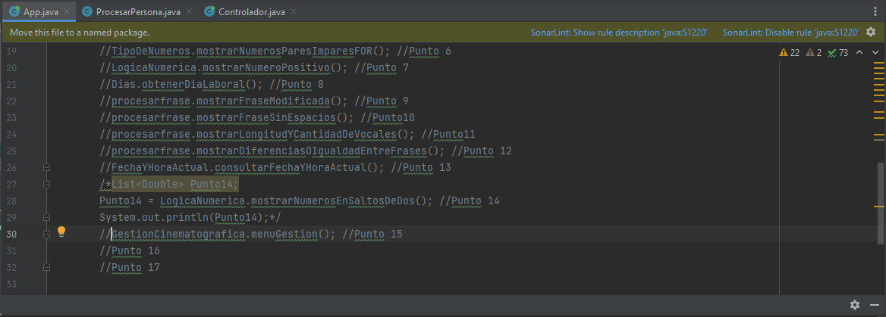

# Ejercicios de Java

En este proyecto se pretende realizar unos ejercicios de java, realizados por Carlos Rojas para practicar conocimientos como:

* Modelamiento de objetos aplicando Programación Orientada a Objetos (POO)
* Creación de entidades
* Buenas prácticas de programación en la contrucción del caso de negocio
* Manejo de librerías básicas como Scanner y Arrays

Para esto se definen las siguientes secciones:
  1. [Configuración inicial](#configuración-inicial)
  2. [Indicaciones para correr los puntos](#indicaciones-para-correr-los-puntos)
  3. [Requerimientos](#requerimientos)

## Configuración inicial

Para poder iniciar con los ejercicios se debe ubicar en la carpeta Ejercicios Java, en esta se encontrarán una serie de archivos.

Posteriormente en un IDE debemos abrir los siguientes archivos de Java en la carpeta src (App.java, objetoelectrodomestico/Controlador.java y fundamentoclases/ProcesarPersona)

Al correr estos códigos de cierta manera se podrá evidenciar cada uno de los ejercicios realizados

## Indicaciones para correr los puntos

El el archivo App.java se encontrarán los ejercicios desde el punto 1 hasta el punto 15, para correr cada uno de los puntos se debe hacer lo siguiente:

Se debe descomentar cada sección de código (por cada llamado a una función hay un comentario que indica el número del punto).

Solo se debe llamar a un punto por ejecución de código, ya que la clase Scanner se cierra en la mayoría de puntos, lo que puede poner problemas si se van a ejecutar 2 funciones consecutivamente.

El punto 14 implica un bloque de códgo de 3 lineas, ya que retorna un valor.

Por otro lado en el archivo fundamentoclases/ProcesarPersona.java se tiene el código que ejecuta el punto 16 (creación de las personas con sus datos)

Además, el código que ejecuta el punto 17 se llama objetoelectrodomestico/Controlador. java (reación de los objetos electrodomesticos e impresión de precios dependiendo de la clase)

## Requerimientos

Para usar este proyecto es necesario tener algún IDE que permita el manejo de Java y JDK 11 si se es posible.